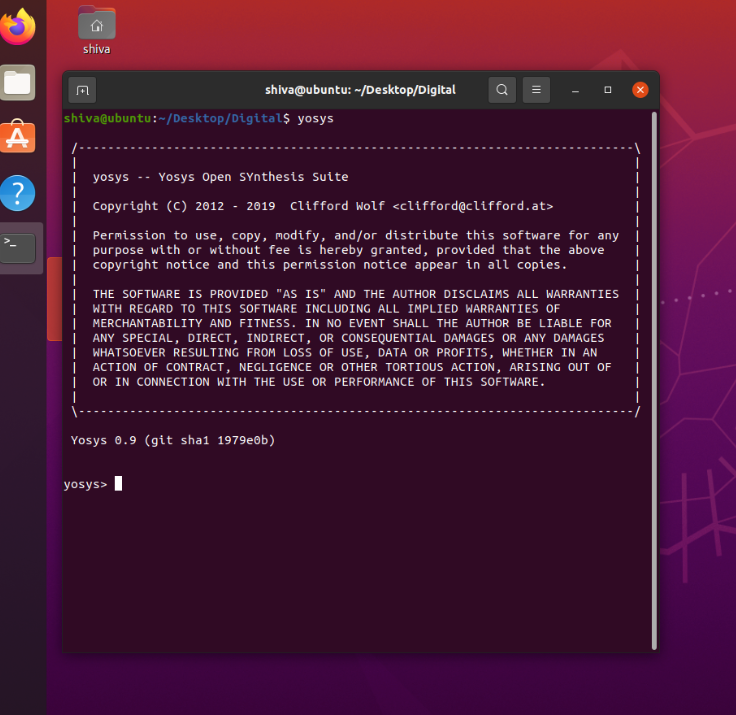
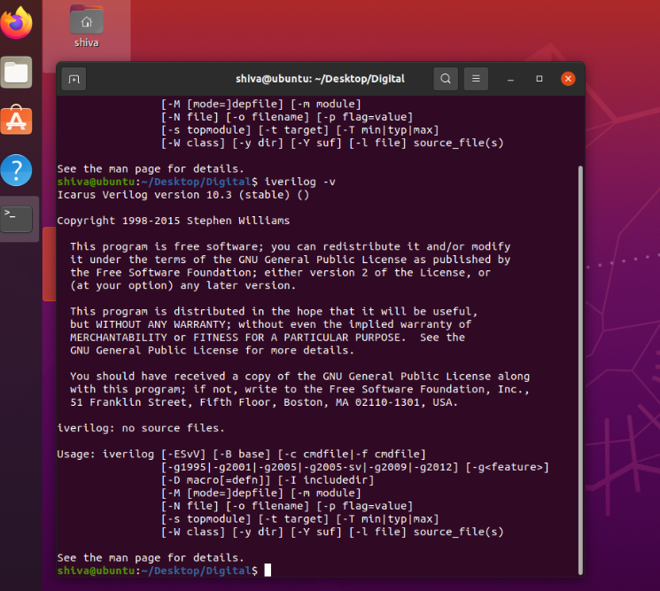

# RISC-V SoC Tapeout Program 


## Tool Setup & Installation Guide
### System Requirements
My system meets the following requirements while proceeding with installation:

- 4 GB RAM
- 50 GB HDD
- Ubuntu 20.04.06
- 4 vCPU

## Tool Installation & Verification
### 1.Yosys Installation

```bash
$ sudo apt-get update
$ git clone https://github.com/YosysHQ/yosys.git
$ cd yosys
$ sudo apt install make   # Only if 'make' is not installed
$ sudo apt-get install build-essential clang bison flex \
    libreadline-dev gawk tcl-dev libffi-dev git \
    graphviz xdot pkg-config python3 libboost-system-dev \
    libboost-python-dev libboost-filesystem-dev zlib1g-dev
$ make config-gcc
```


Initialize the required Git submodule (abc) before building


```bash
$ git submodule update --init --recursive
$ make
$ sudo make install
```

### Terminal Result

<div align="center">
    


</div>

## 2. Icarus Verilog (Iverilog) Installation


```bash
$ sudo apt-get update
$ sudo apt-get install iverilog
```

### Terminal Result

<div align="center">
    


</div>

## 3. GTKWave Installation

```bash
$ sudo apt-get update
$ sudo apt install gtkwave
```

### Terminal Result

<div align="center">
    


</div>
